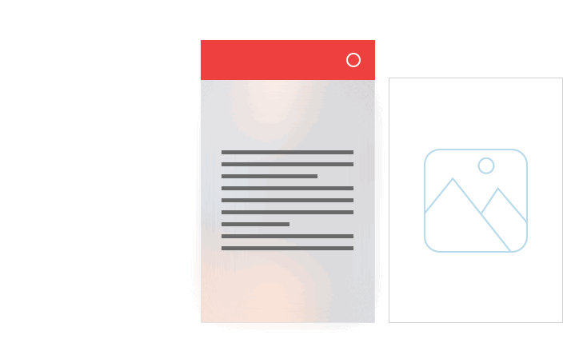
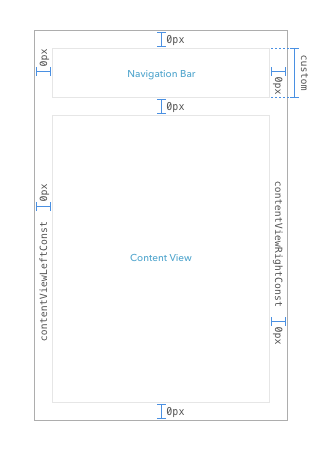
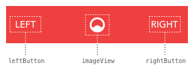

# CLNavigationBar
Customizable NavigationBar for iOS

## Overview
CLNavigationBar is a highly customizable Navigation Bar, where any UIView can be your Navigation Bar which sticks to the top.

## Demo
Here is a short demo of how CLNavigationBar works:

## Components
The navigation bar consists of 4 classes: 
- `CLViewController`
- `CLNavigationBar`
- `CLSegue`
- `CLSegueUnwind`

All of your ViewControllers, in which you want to include the navigation bar, have to sublclass the `CLViewController` class. 
A view from a ViewController that subclasses `CLViewController` has the following layout:

The navigation bar can be every UIView you want and the content view contains the main user interface. In the source code is a simple navigation bar included (the `CLNavigationBar` class) which you can use or create your very own navigation bar (further instructions in "Usage").

The `CLSegue` and `CLSegueUnwind` classes are for the transitions between the ViewControllers (which have to be a subclass of `CLViewController`)

## Usage
### Setting up a ViewController
1. Create a new class which subclasses `CLViewController`
2. Go to Interface Builder and drag a new ViewController on the canvas, set it's class to your custom ViewController class
3. Drag two UIView's on the ViewController and lay them out like in the picture above (note that your navigation bar's height can be any custom size you want)
4. Set the class for the UIView you want to be your navigation bar to `CLNavigationBar`
5. Connect the views to the outlets `navigationBar` and `contentView`
   Connect the left and right constraints from the content view to the outlets `contentViewLeftConst`and `contentViewRightConst`
   -> to do so right-click on your ViewController object in the outline view in IB and then connect the outlets.
You cannot use `CLSegue` / `CLSegueUnwind` with normal ViewControllers

### Setting up the Content View
The only thing you have to pay attention for is that all of your user interface have to be subviews of the contentView.

### Setting up the Navigation Bar
As mentioned before there already is a navigation bar class in the source code which you can use. But you can also create your own custom navigation bar, more on that later.
First: How to use the included `CLNavigationBar` class

##### Standard Navigation Bar
The standard `CLNavigationBar` has buttons on the left and right side and an image in the center.

You can set basic properties for the navigation bar in Interface Builder.
- `Display Left Button (Bool)`: Determines wether left button should be displayed in navigation bar
- `Display Right Button (Bool)`: Determines wether right button should be displayed in navigation bar
- `Left Button Text (String)`: Sets the title for the left button
- `Right Button Text (String)`: Sets the title for the right button

For more customization go into the `CLNavigationBar.swift` file. Here you can change more properties
- `navbarColor (UIColor)`: The background color of your navigation bar
- `buttonFont (UIFont)`: The font of left and right button's title label
- `buttonTitleColor (UIColor)`: The color of left and right button's title label
- `imageName (String)`: The name for the image which should be displayed in the image view
- `imageSize (CGFloat)`: The size for the image view

To respond to taps on either left or right button, override these two methods in your ViewController
- `func navbarLeftItemAction(button:UIButton)`
- `func navbarRightItemAction(button:UIButton)`

##### Custom Navigation Bar
To create your own navigation bar you only have to override (not subclass!) the `CLNavigationBar` class and make your own setup in the class.

### Setting up the Transitions

##### Forward
If you have two ViewController's that are both subclasses from `CLViewController` and are setup like described before you can create a transition between them.
1. Go to Interface Builder and drag a segue from your first to your second ViewController
2. Change the segue kind to custom, give it an identifier and set it's custom class to `CLSegue`

That's it. If you want to move between ViewController's programmatically, use `performSegue(withIdentifier:String, sender:Any)`, use your segue identifier and pass `self` as sender.

##### Unwind
1. In Interface Builder connect your ViewController to Exit and select `returnFromSegueActionsWithSender:`
2. Select your unwinding segue and give it an identifier
3. In the corresponding ViewController class, in `viewDidLoad`, set the property `unwindingSegueID` to the identifier you gave your unwining segue in IB

`CLViewController` has a `UISwipeGestureRecognizer` implemented which performs the unwinding segue when swiping from right to left. To perform the unwinding segue programmatically, simply call `performUnwindSegue()`.

## License
See the [LICENSE](License.md) file for license rights and limitations (MIT).
